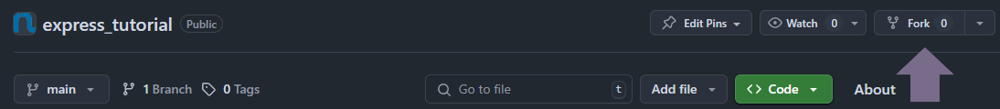
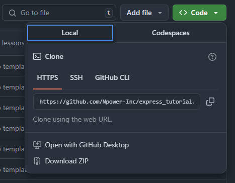
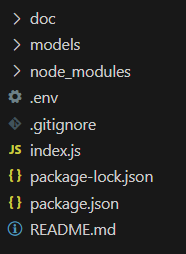

# Path2Tech Express Tutorial

This repository will help guide you on getting familiar with using Express to build API and Server applicaitons.

## Prerequisites
- Node.js and NPM installed
- An environment to run JavaScript
    - Having Node.js installed on your system
    - You can run JavaScript with Visual Studio code if you have the Node.js extension installed
- A MongoDB account set up with a cluster to connect to.


## Checking Prerequisites
1. Check that you have Node and NPM installed, open a terminal and run

```sh
node --version
```

```sh
npm --version
```

If you get an error then you will need to go to [Download Node](https://nodejs.org/en/download) to download Node.js for your operating system.

2. You wil need to have a MongoDB Atlas Account with a MongoDB Cluster set up. To accomplish this go to [MongoDB Atlas Account Creation](https://account.mongodb.com/account/register) to create an account and create a cluster. Once you create your cluster you should eventually see a connection string with your credentials to be able to connect, below is an example of what your credendtials should look like.


**You will need to replace <db_username> with the username of your CREATED user (not your actual MongoDB login credentials) and replace <db_password> with the password of your CREATED user (not your actual MongoDB login credentials)**


## Installing Project
1. Please make sure to fork this repository to your personal GitHub. You will find the button to fork this repository near the top right part of the screen.



Press this button and on the next screen it will give you the option to fork the repository make sure to click the green button title "Create fork" to fork the repositoy to your own GitHub

2. Clone the repository to your machine, to do this open a new terminal and run

```sh
https://github.com/<github_repo_owner>/<github_repo_name>.git
```

To get the GitHub URL to clone the repo click on the green button title "<> Code" this will open a dropdown and you can copy the URL to clone this git repository to your system.



## Getting Started
1. You will have to install your node packages from `package.json` to `node_modules`

To accomplish this, open this project in Visual Studio Code, and open a new terminal session

Run the command
```sh
npm install
```

2. To run the code you have two options, to run it with Visual Studio Code's GUI or to open a terminal and run the following command

```sh
npm run dev 
```

## Adding Mongoose to your Express Application - Lesson 3 of Express

1. Get your MongoDB Connection string and create a new file called `.env` which needs to be located in the ROOT directory of this project. Below is an example of what your project directory structure should look like 



After you create your `.env` file open it up in your Visual Studio Code and add this to it:

```
DB_URL="Replace Database URL with the URL of your MongoDB Cluster"
```

2. In the `index.js` code file you will need to uncomment these following lines to be able to make a connection to your MongoDB Cluster

```JavaScript
// const mongoose = require("mongoose"); // uncomment this line for lesson 3 of express
// const itemModel = require("./models/items"); // uncomment this line for
// const dbURL = process.env.dbURL; // uncomment this line for lesson 3 of express 
// mongoose.connect(dbURL)
// .then(() => console.log("Connected to MongoDB"))
// .catch((err) => console.error(err.message))
```

After you uncomment the lines and run the application, as long as you set up your database credentials properly, your application should connect to your database, and you should be able to use the `itemModel` variable to communcate with the `items` table in your MongoDB Cluster.

## Available Commands

This following command is useful to install all node dependencies from `package.json` to your development environment.
```sh
npm install
```

This following command is useful to install a specific node dependency to your development environment.
```sh
npm install <package-name>
```

This following command lets you run your application and does not come with auto reloading when changes are made in your JavaScript code files. This option is best used when pushing your code to production.
```sh
npm run start
```

This following command lets you run your application and comes with auto reloading when changes are made in your JavaScript code files. This option is best used in development when developing the application
```sh
npm run dev
```

## Final Notes
If you followed all the steps above correctly your environment should be set up, if there are issues you will need to go back and fix them.